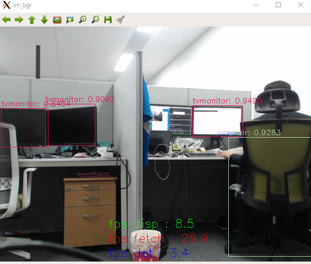
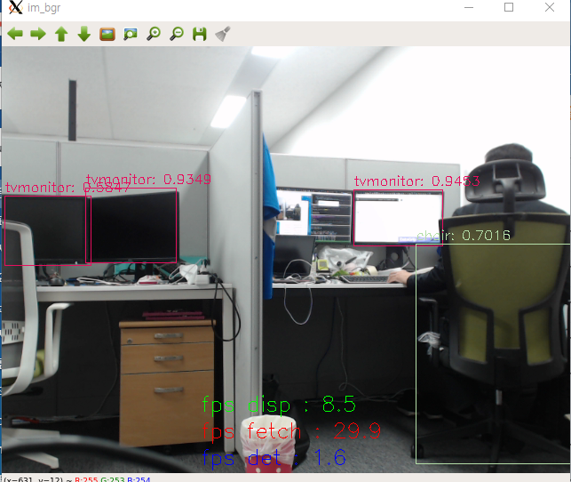

# comparision of frames rates(fps) of fetching / object detection / display of camera feed between using threading and multiprocessing
* python : 3.5.6
* opencv : 3.4.3

  * frame rates when using threading
    * fetch : 
    * detection : 
    * display : 
    
  
  

  * frame rates when using multiprocessing
    * fetch : 
    * detection : 
    * display : 
  
  
  
  I am not sure why. The biggest different is that detection thread of threading is faster than that of multiprocessing.  The others are almost the same.
